# Telemetria_Backend
Backend Sistema Telemetria Reborn

El siguiente proyecto, busca crear un software de telemetria para el monitoreo de el bus como unidad y sus componentes por separado.

## Tecnologias Utilizadas.
***

### `Backend`.
- Python 
- Django 
- DRF
- Servicios AWS
- PostgreSQL

### `Frontend`.
- Javascript
- React 
- Axios


# Esquema obtencion de datos.

Nuestros buses envian mensajes de estado de cada uno de los componentes que lo componen a un hardware llamado Sniffer, por medio de mensajes CAN, el cual se encarga de recibirlos y almacenarlos en un archivo .MF4, el cual es enviado a un bucket de AWS S3.

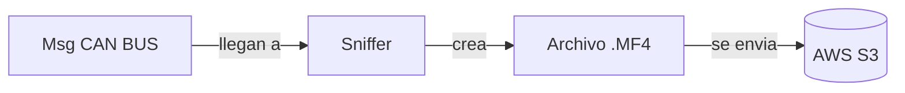

# Estructura Backend.

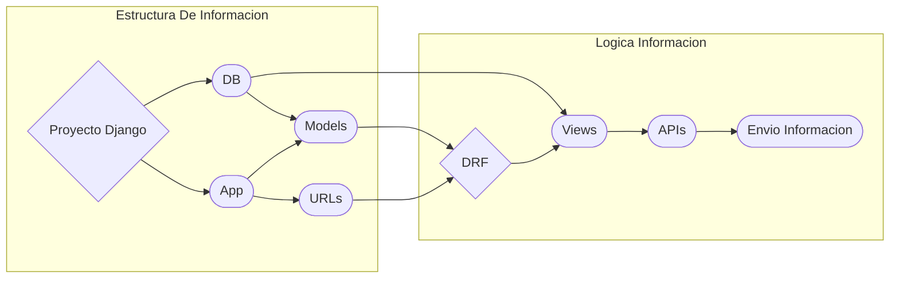

El backend se compone por un proyecto de Django, el cual posee un Base de Datos y aplicaciones, asu vez cada una de estas aplicaciones posee modelos, vistas y urls, las cuales son utilizadas por el framework Django Rest Framework para la creacion de las APIs.

# Aplicaciones Django.

Cada aplicacion debe manejar la informacion de un componente del bus, por lo que se crearan las siguientes aplicaciones.
Estas aplicaciones deben manejar esta unica logica y su codigo puede ser reutilizado en otras aplicaciones.

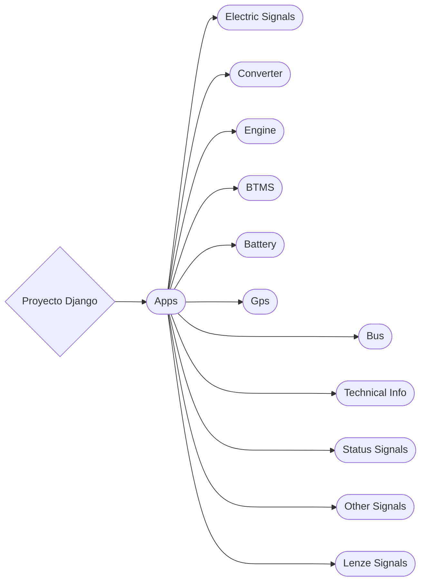

# Aplicacion Bus.

La aplicacion Bus, se encargara de manejar toda la informacion de este mismo

- `Modelo Bus ` Manejara la Informacion Tecnica del Bus. 

## `Modelo Bus`

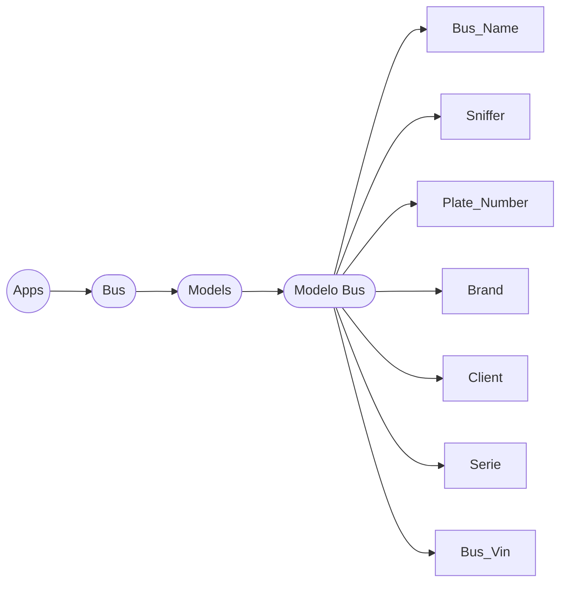


# Aplicacion Technical Info.
La aplicacion Technical Info, se encargara de manejar datos tecnicos del bus, algunos relacionados con el funcionamiento del bus y otros relacionados con la operacion del bus.

## `Modelo Fusi Messages`
- El modelos `Fusi Messages` maneja los mensajes de error del bus, los cuales son enviados por el bus a traves de los mensajes CAN.


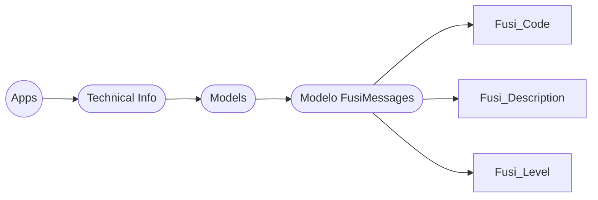
## `Modelo Paths Buckets`
- El modelo `Paths Buckets` maneja los paths de los archivos .MF4 que se encuentran en los buckets de AWS S3.

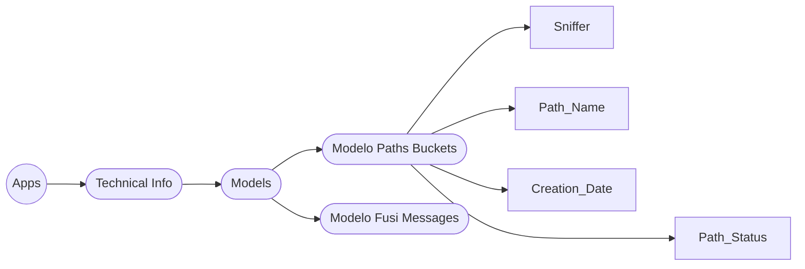
La informacion de este modelo llega gracias a una `funcion lambda` que se encarga de rescatar eventos que suceden en el bucket de AWS S3, y se encarga de crear un registro en la base de datos con la informacion del archivo .MF4 (el directorio donde fue subido este archivo).

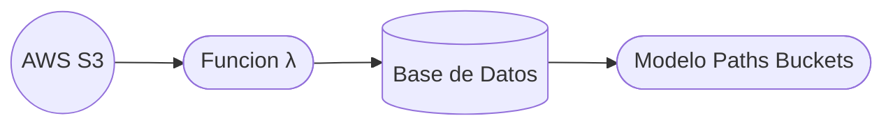
___

## `Modelo Rem Technician`
- El modelo `Rem Technician` maneja los tecnicos que se encargan de trabajar en los buses , ya sean del equipo de mantenimiento o no, este modelo se usa para la generacion de OT y para el registro de los tecnicos que trabajan en los buses.

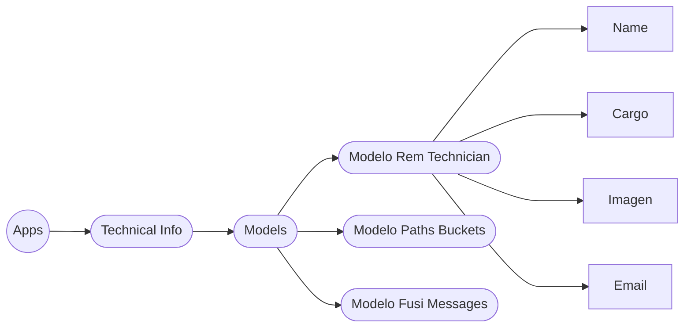

## `Modelo Rem Work Order`
- El modelo `Rem Work Order` maneja las ordenes de trabajo que se generan para los buses y Fabrica, estas ordenes de trabajo son generadas por los tecnicos que trabajos, estas OT seran Desplegadas en los los perfiles unicos de cada bus, las OT de fabrica apareceran en el Dashboard principal

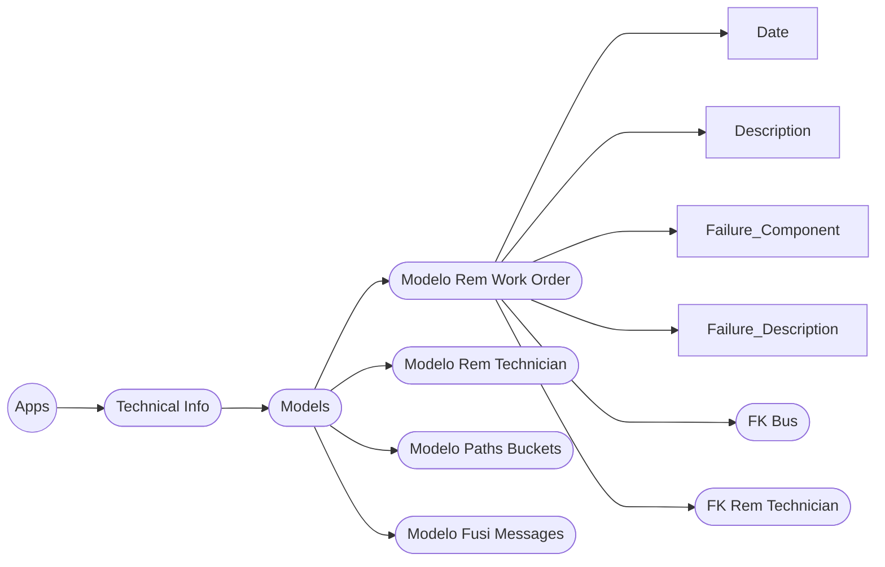
## `Modelo Mark Version`
- Este modelo maneja la informacion de la version que posee el bus del software Mark

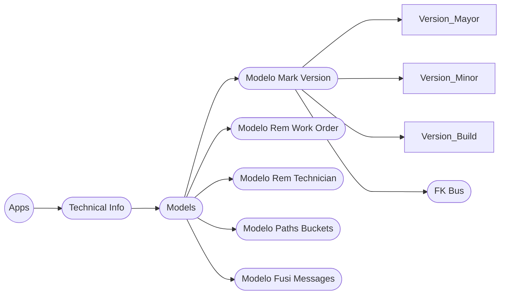

# Aplicacion Status Signals.
La aplicacion Status Signals, se encargara de manejar los datos de los sensores de estado del bus.

## `Modelo Fusi Code.`
- El modelo `Fusi Code` maneja los codigos de error del bus, estos codigos son enviados por el bus a traves de los mensajes CAN.

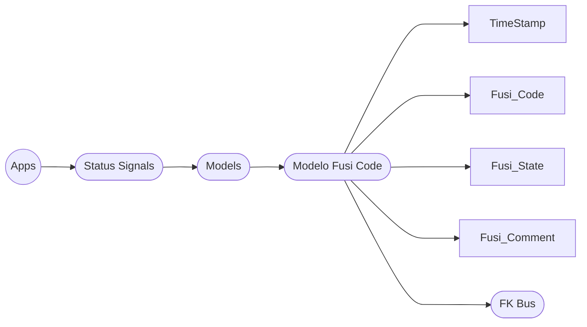
## `Modelo Charge Status`
- El modelo `Charge Status` indica cuando un bus se encuentra en proceso de carga y cuando no.

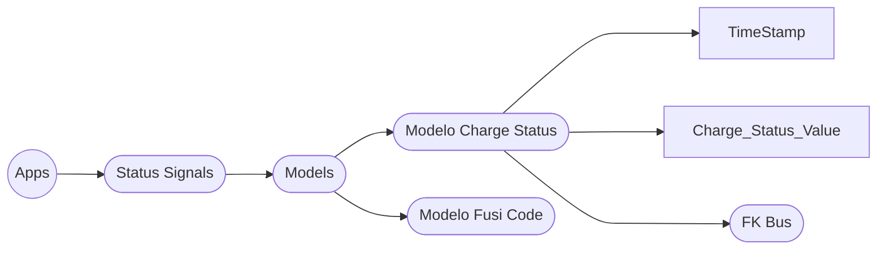
## `Modelo Gear`
- El modelo `Gear` indica el estado de la caja de cambios del bus.

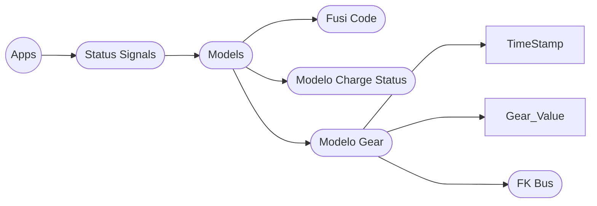

## `Modelo Bus State`
 
 - `Modelo Bus Estate` Manejara la informacion de estado del bus (operativo, fuera de servicio)

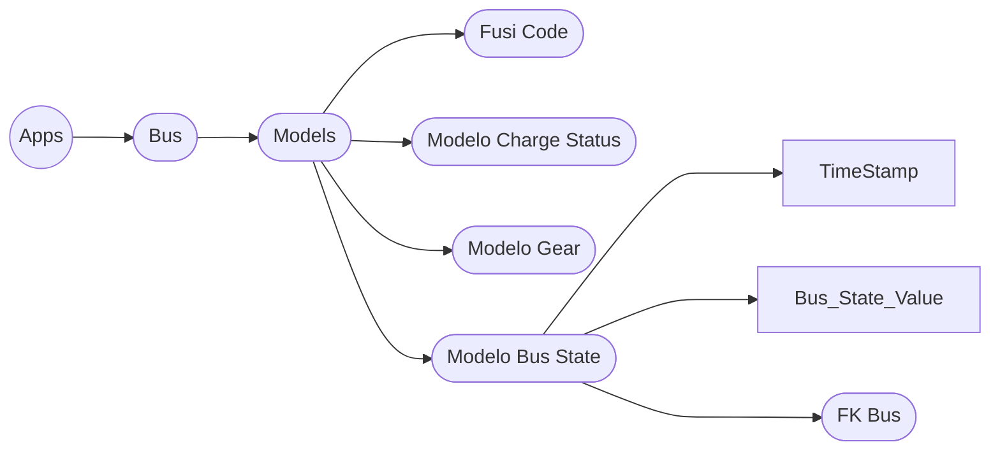

## `Modelo Brake Pedal`
- El modelo `Brake Pedal` maneja la informacion del pedal de freno del bus.

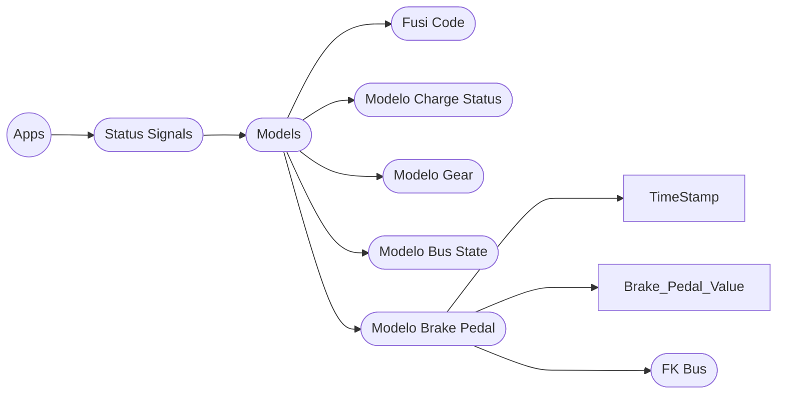


# Aplicacion Engine Signals.    
La aplicacion Engine Signals, se encargara de manejar los datos de los sensores del motor del bus.

## `Modelo Positive Torque`
- El modelo `Positive Torque` maneja la informacion del torque positivo del motor del bus.


## `Modelo negative Torque`
- El modelo `Negative Torque` maneja la informacion del torque negativo del motor del bus.

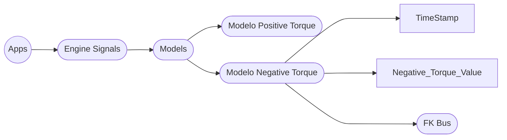

## `Modelo Engine Temperature`
- El modelo `Engine Temperature` maneja la informacion de la temperatura del motor del bus.

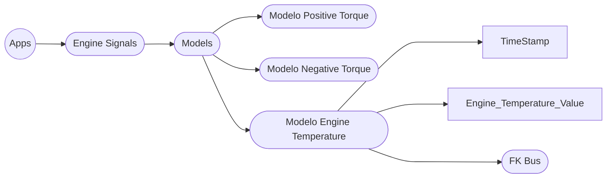
# Aplicacion Lenze Signals.
La aplicacion Lenze Signals, se encargara de manejar los datos del Lenze.

## `Modelo Lenze Current`
- El modelo `Lenze Current` maneja la informacion de la corriente del Lenze.

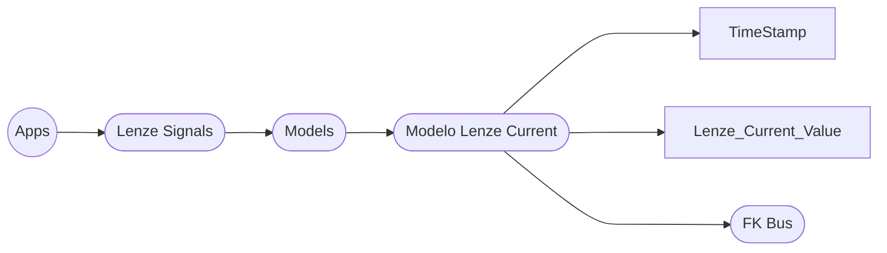

## `Modelo Velocidad Motor Lenze`
- El modelo `Velocidad Motor Lenze` maneja la informacion de la velocidad del motor del Lenze.

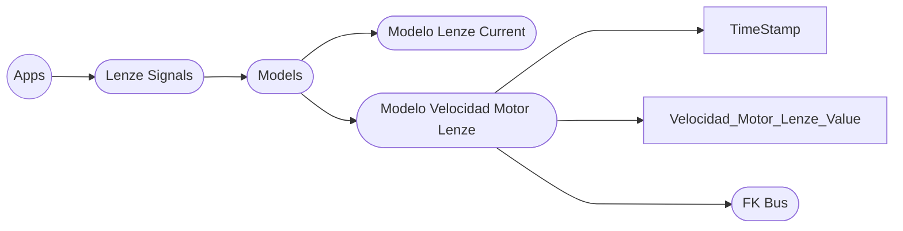
# Aplicacion Battery Signals.
La aplicacion Battery Signals, se encargara de manejar los datos de la bateria del bus ya sea baterias de 24 V como el pack de baterias.

## `Modelo Battery 24 V`
- El modelo `Battery 24 V` maneja la informacion de la bateria de 24 V.

```mermaid
flowchart LR
A((Apps)) --> B([Battery Signals])
B([Battery Signals]) --> C([Models])
C([Models]) --> D([Modelo Battery 24 V])
D([Modelo Battery 24 V]) ---> TimeStamp
D([Modelo Battery 24 V]) ---> Battery_24_V_Value
D([Modelo Battery 24 V]) ---> I([FK Bus])
```
## `Modelo Soc`
- El modelo `Soc` maneja la informacion del estado de carga de la bateria.

```mermaid
flowchart LR
A((Apps)) --> B([Battery Signals])
B([Battery Signals]) --> C([Models])
C([Models]) --> D([Modelo Battery 24 V])
C([Models]) --> E([Modelo Soc])
E([Modelo Soc]) ---> TimeStamp
E([Modelo Soc]) ---> Soc_Value
E([Modelo Soc]) ---> I([FK Bus])
```
## `Modelo Battery Temperature 600`
- El modelo `Battery Temperature 600` maneja la informacion de la temperatura de la bateria de 600 V.

```mermaid
flowchart LR
A((Apps)) --> B([Battery Signals])
B([Battery Signals]) --> C([Models])
C([Models]) --> D([Modelo Battery 24 V])
C([Models]) --> E([Modelo Soc])
C([Models]) --> F([Modelo Battery Temperature 600])
F([Modelo Battery Temperature 600]) ---> TimeStamp
F([Modelo Battery Temperature 600]) ---> Battery_Temperature_600_Value
F([Modelo Battery Temperature 600]) ---> I([FK Bus])
```
## `Modelo Max Temperature Pack 600`
- El modelo `Max Temperature Pack 600` maneja la informacion de la temperatura maxima del pack de baterias de 600 V.

```mermaid  
flowchart LR
A((Apps)) --> B([Battery Signals])
B([Battery Signals]) --> C([Models])
C([Models]) --> D([Modelo Battery 24 V])
C([Models]) --> E([Modelo Soc])
C([Models]) --> F([Modelo Battery Temperature 600])
C([Models]) --> G([Modelo Max Temperature Pack 600])
G([Modelo Max Temperature Pack 600]) ---> TimeStamp
G([Modelo Max Temperature Pack 600]) ---> Max_Temperature_Pack_600_Value
G([Modelo Max Temperature Pack 600]) ---> I([FK Bus])
```
## `Modelo Min Temperature Pack 600`
- El modelo `Min Temperature Pack 600` maneja la informacion de la temperatura minima del pack de baterias de 600 V.

```mermaid
flowchart LR
A((Apps)) --> B([Battery Signals])
B([Battery Signals]) --> C([Models])
C([Models]) --> D([Modelo Battery 24 V])
C([Models]) --> E([Modelo Soc])
C([Models]) --> F([Modelo Battery Temperature 600])
C([Models]) --> G([Modelo Max Temperature Pack 600])
C([Models]) --> H([Modelo Min Temperature Pack 600])
H([Modelo Min Temperature Pack 600]) ---> TimeStamp
H([Modelo Min Temperature Pack 600]) ---> Min_Temperature_Pack_600_Value
H([Modelo Min Temperature Pack 600]) ----> I([FK Bus])
```
## `Modelo Battery Health`
- El modelo `Battery Health` maneja la informacion de la salud de la bateria.

```mermaid
flowchart LR
A((Apps)) --> B([Battery Signals])
B([Battery Signals]) --> C([Models])
C([Models]) --> D([Modelo Battery 24 V])
C([Models]) --> E([Modelo Soc])
C([Models]) --> F([Modelo Battery Temperature 600])
C([Models]) --> G([Modelo Max Temperature Pack 600])
C([Models]) --> H([Modelo Min Temperature Pack 600])
C([Models]) --> I([Modelo Battery Health])
I([Modelo Battery Health]) ---> TimeStamp
I([Modelo Battery Health]) ---> Battery_Health_Value
I([Modelo Battery Health]) ---> K([FK Bus])
```

## `Modelo Battery Pack Current`
- El modelo `Battery Pack Current` maneja la informacion de la corriente del pack de baterias.

```mermaid
flowchart LR
A((Apps)) --> B([Battery Signals])
B([Battery Signals]) --> C([Models])
C([Models]) --> D([Modelo Battery 24 V])
C([Models]) --> E([Modelo Soc])
C([Models]) --> F([Modelo Battery Temperature 600])
C([Models]) --> G([Modelo Max Temperature Pack 600])
C([Models]) --> H([Modelo Min Temperature Pack 600])
C([Models]) --> I([Modelo Battery Health])
C([Models]) --> J([Modelo Battery Pack Current])
J([Modelo Battery Pack Current]) ---> TimeStamp
J([Modelo Battery Pack Current]) ---> Battery_Pack_Current_Value
J([Modelo Battery Pack Current]) ---> L([FK Bus])
```

## `Modelo Battery Pack Voltage`
- El modelo `Battery Pack Voltage` maneja la informacion de la tension del pack de baterias.

```mermaid
flowchart LR
A((Apps)) --> B([Battery Signals])
B([Battery Signals]) --> C([Models])
C([Models]) --> D([Modelo Battery 24 V])
C([Models]) --> E([Modelo Soc])
C([Models]) --> F([Modelo Battery Temperature 600])
C([Models]) --> G([Modelo Max Temperature Pack 600])
C([Models]) --> H([Modelo Min Temperature Pack 600])
C([Models]) --> I([Modelo Battery Health])
C([Models]) --> J([Modelo Battery Pack Current])
C([Models]) --> K([Modelo Battery Pack Voltage])
K([Modelo Battery Pack Voltage]) ---> TimeStamp
K([Modelo Battery Pack Voltage]) ---> Battery_Pack_Voltage_Value
K([Modelo Battery Pack Voltage]) ---> M([FK Bus])
```
## `Modelo Max Voltage Cell`
- El modelo `Max Voltage Cell` maneja la informacion de la tension maxima de la celda.

```mermaid 
flowchart LR
A((Apps)) --> B([Battery Signals])
B([Battery Signals]) --> C([Models])
C([Models]) --> D([Modelo Battery 24 V])
C([Models]) --> E([Modelo Soc])
C([Models]) --> F([Modelo Battery Temperature 600])
C([Models]) --> G([Modelo Max Temperature Pack 600])
C([Models]) --> H([Modelo Min Temperature Pack 600])
C([Models]) --> I([Modelo Battery Health])
C([Models]) --> J([Modelo Battery Pack Current])
C([Models]) --> K([Modelo Battery Pack Voltage])
C([Models]) --> L([Modelo Max Voltage Cell])
L([Modelo Max Voltage Cell]) ---> TimeStamp
L([Modelo Max Voltage Cell]) ---> Max_Voltage_Cell_Value
L([Modelo Max Voltage Cell]) ---> N([FK Bus])
```
## `Modelo Min Voltage Cell`
- El modelo `Min Voltage Cell` maneja la informacion de la tension minima de la celda.

```mermaid
flowchart LR
A((Apps)) --> B([Battery Signals])
B([Battery Signals]) --> C([Models])
C([Models]) --> D([Modelo Battery 24 V])
C([Models]) --> E([Modelo Soc])
C([Models]) --> F([Modelo Battery Temperature 600])
C([Models]) --> G([Modelo Max Temperature Pack 600])
C([Models]) --> H([Modelo Min Temperature Pack 600])
C([Models]) --> I([Modelo Battery Health])
C([Models]) --> J([Modelo Battery Pack Current])
C([Models]) --> K([Modelo Battery Pack Voltage])
C([Models]) --> L([Modelo Max Voltage Cell])
C([Models]) --> M([Modelo Min Voltage Cell])
M([Modelo Min Voltage Cell]) ---> TimeStamp
M([Modelo Min Voltage Cell]) ---> Min_Voltage_Cell_Value
M([Modelo Min Voltage Cell]) ---> O([FK Bus])
```
## `Modelo Average Voltage Cell`
- El modelo `Average Voltage Cell` maneja la informacion de la tension promedio de la celda.

```mermaid
flowchart LR
A((Apps)) --> B([Battery Signals])
B([Battery Signals]) --> C([Models])
C([Models]) --> D([Modelo Battery 24 V])
C([Models]) --> E([Modelo Soc])
C([Models]) --> F([Modelo Battery Temperature 600])
C([Models]) --> G([Modelo Max Temperature Pack 600])
C([Models]) --> H([Modelo Min Temperature Pack 600])
C([Models]) --> I([Modelo Battery Health])
C([Models]) --> J([Modelo Battery Pack Current])
C([Models]) --> K([Modelo Battery Pack Voltage])
C([Models]) --> L([Modelo Max Voltage Cell])
C([Models]) --> M([Modelo Min Voltage Cell])
C([Models]) --> N([Modelo Average Voltage Cell])
N([Modelo Average Voltage Cell]) ---> TimeStamp
N([Modelo Average Voltage Cell]) ---> Average_Voltage_Cell_Value
N([Modelo Average Voltage Cell]) ---> P([FK Bus])
```


# Aplicacion BTMS Signals
BTMS , Battery Temperature Management System, es un sistema de gestion de temperatura de baterias que se encarga de mantener la temperatura de las baterias en un rango optimo para el funcionamiento de la bateria. Este sistema se encarga de regular la temperatura de las baterias mediante el uso de ventiladores y/o calefaccion.

## `BTMS Status`
- El modelo `BTMS Status` maneja la informacion del estado del sistema BTMS.

```mermaid
flowchart LR
A((Apps)) --> B([BTMS Signals])
B([BTMS Signals]) --> C([Models])
C([Models]) --> D([Modelo BTMS Status])
D([Modelo BTMS Status]) ---> TimeStamp
D([Modelo BTMS Status]) ---> BTMS_Status_Value
D([Modelo BTMS Status]) ---> E([FK Bus])
```
## `BTMS Power Request`
- El modelo `BTMS Power Request` maneja la informacion de la potencia solicitada por el sistema BTMS.

```mermaid
flowchart LR
A((Apps)) --> B([BTMS Signals])
B([BTMS Signals]) --> C([Models])
C([Models]) --> D([Modelo BTMS Status])
C([Models]) --> E([Modelo BTMS PowerRequest])
E([Modelo BTMS PowerRequest]) ---> TimeStamp
E([Modelo BTMS PowerRequest]) ---> BTMS_PowerRequest_Value
E([Modelo BTMS PowerRequest]) ---> F([FK Bus])
```

## `BTMS Fault Code`
- El modelo `BTMS Fault Code` maneja la informacion del codigo de error del sistema BTMS.

```mermaid
flowchart LR
A((Apps)) --> B([BTMS Signals])
B([BTMS Signals]) --> C([Models])
C([Models]) --> D([Modelo BTMS Status])
C([Models]) --> E([Modelo BTMS PowerRequest])
C([Models]) --> F([Modelo BTMS Fault Code])
F([Modelo BTMS Fault Code]) ---> TimeStamp
F([Modelo BTMS Fault Code]) ---> BTMS_FaultCode_Value
F([Modelo BTMS Fault Code]) ---> G([FK Bus])
```

## `BTMS Temperature`
- El modelo `BTMS Temperature` maneja la informacion de la temperatura del sistema BTMS.

```mermaid
flowchart LR
A((Apps)) --> B([BTMS Signals])
B([BTMS Signals]) --> C([Models])
C([Models]) --> D([Modelo BTMS Status])
C([Models]) --> E([Modelo BTMS PowerRequest])
C([Models]) --> F([Modelo BTMS Fault Code])
C([Models]) --> G([Modelo BTMS Temperature])
G([Modelo BTMS Temperature]) ---> TimeStamp
G([Modelo BTMS Temperature]) ---> BTMS_Temperature_Value
G([Modelo BTMS Temperature]) ---> H([FK Bus])
```
##  `BTMS Active`
- El modelo `BTMS Active` maneja la informacion de si el sistema BTMS esta activo o no.

```mermaid
flowchart LR
A((Apps)) --> B([BTMS Signals])
B([BTMS Signals]) --> C([Models])
C([Models]) --> D([Modelo BTMS Status])
C([Models]) --> E([Modelo BTMS PowerRequest])
C([Models]) --> F([Modelo BTMS Fault Code])
C([Models]) --> G([Modelo BTMS Temperature])
C([Models]) --> H([Modelo BTMS Active])
H([Modelo BTMS Active]) ---> TimeStamp
H([Modelo BTMS Active]) ---> BTMS_Active_Value
H([Modelo BTMS Active]) ---> I([FK Bus])
```
# Aplicacion Other Signals.
Esta aplicacion maneja datos de algunos mensajes CAN que no clasifican en otras aplicaciones.

## `Modelo AC Status`
- El modelo `AC Status` maneja la informacion de la condicion del aire acondicionado del bus.

```mermaid
flowchart LR
A((Apps)) --> B([Other Signals])
B([Other Signals]) --> C([Models])
C([Models]) --> D([Modelo AC Status])
D([Modelo AC Status]) ---> TimeStamp
D([Modelo AC Status]) ---> AC_Status_Value
D([Modelo AC Status]) ---> I([FK Bus])
```

## `Modelo Odometer`
- El modelo `Odometer` maneja la informacion del odometro del bus.

```mermaid
flowchart LR
A((Apps)) --> B([Other Signals])
B([Other Signals]) --> C([Models])
C([Models]) --> D([Modelo AC Status])
C([Models]) --> E([Modelo Odometer])
E([Modelo Odometer]) ---> TimeStamp
E([Modelo Odometer]) ---> Odometer_Value
E([Modelo Odometer]) ---> I([FK Bus])
```

## `Modelo Pressure`
- El modelo `Pressure` maneja la informacion de la presion total del sistema del bus.

```mermaid
flowchart LR
A((Apps)) --> B([Other Signals])
B([Other Signals]) --> C([Models])
C([Models]) --> D([Modelo AC Status])
C([Models]) --> E([Modelo Odometer])
C([Models]) ---> F([Modelo Pressure])
F([Modelo Pressure]) ---> TimeStamp
F([Modelo Pressure]) ---> Pressure_Value
F([Modelo Pressure]) ---> I([FK Bus])
```

## `Modelo Speed`
- El modelo `Speed` maneja la informacion de la velocidad del bus.

```mermaid
flowchart LR
A((Apps)) --> B([Other Signals])
B([Other Signals]) --> C([Models])
C([Models]) --> D([Modelo AC Status])
C([Models]) --> E([Modelo Odometer])
C([Models]) --> F([Modelo Pressure])
C([Models]) ---> G([Modelo Speed])
G([Modelo Speed]) ---> TimeStamp
G([Modelo Speed]) ---> Speed_Value
G([Modelo Speed]) ---> I([FK Bus])
```

## `Modelo Service Compressor`
- El modelo `Service Compressor` maneja la informacion del estado del compresor de servicio del bus.

```mermaid
flowchart LR
A((Apps)) --> B([Other Signals])
B([Other Signals]) --> C([Models])
C([Models]) --> D([Modelo AC Status])
C([Models]) --> E([Modelo Odometer])
C([Models]) --> F([Modelo Pressure])
C([Models]) --> G([Modelo Speed])
C([Models]) ---> H([Modelo Service Compressor])
H([Modelo Service Compressor]) --> TimeStamp
H([Modelo Service Compressor]) --> Service_Compressor_Value
H([Modelo Service Compressor]) --> I([FK Bus])
```
# Electrical Signals
Esta aplicacion maneja algunos datos electricos generalizados del bus.

## `Modelo PTC Voltage`
- El modelo `PTC Voltage` maneja la informacion de la tension de la resistencia PTC del bus.

```mermaid
flowchart LR
A((Apps)) --> B([Electrical Signals])
B([Electrical Signals]) --> C([Models])
C([Models]) --> D([Modelo PTC Voltage])
D([Modelo PTC Voltage]) ---> TimeStamp
D([Modelo PTC Voltage]) ---> PTC_Voltage_Value
D([Modelo PTC Voltage]) ---> I([FK Bus])
```

## `Modelo Isolation`
- El modelo `Isolation` maneja la informacion de la tension de aislamiento del bus.

```mermaid  
flowchart LR
A((Apps)) --> B([Electrical Signals])
B([Electrical Signals]) --> C([Models])
C([Models]) --> D([Modelo PTC Voltage])
C([Models]) --> E([Modelo Isolation])
E([Modelo Isolation]) ---> TimeStamp
E([Modelo Isolation]) ---> Isolation_Value
E([Modelo Isolation]) ---> I([FK Bus])
```

# Aplicacion Gps.

## under construction
